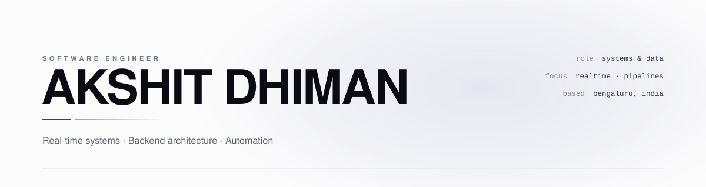

<p align="center">
  <picture>
    <source media="(prefers-color-scheme: dark)" srcset="./assets/banner-dark.svg">
    <source media="(prefers-color-scheme: light)" srcset="./assets/banner-light.svg">
    
  </picture>
</p>

<p align="center">
  <sub>Software Engineer at <b>Wise</b> &nbsp;·&nbsp; Bengaluru, India &nbsp;·&nbsp; <a href="mailto:akshithdh@gmail.com">akshithdh@gmail.com</a></sub>
</p>

<br>

> I build software that stays quiet under load.
> Real-time systems, backend architecture, and automation — the parts nobody claps for, done properly.

---

## what i work on

<table>
<tr><td width="34"><code>01</code></td><td><b>Distributed &amp; real-time systems</b><br><sub>WebRTC mesh, WebSocket signaling, cross-tab state sync. Concurrency and eventual consistency are my lane.</sub></td></tr>
<tr><td width="34"><code>02</code></td><td><b>Full-stack product engineering</b><br><sub>TypeScript end to end — frontends that feel instant, backends that hold up. Shipped coherent, not stitched.</sub></td></tr>
<tr><td width="34"><code>03</code></td><td><b>Automation &amp; AI orchestration</b><br><sub>Workflows that run themselves: steps resolve their own order, independent ones run concurrently, model calls sit in the middle of it.</sub></td></tr>
<tr><td width="34"><code>04</code></td><td><b>Algorithms &amp; systems thinking</b><br><sub>LeetCode <b>1986</b> — top 2% globally, contest rank <b>193 / 29,215</b>. Not a flex; it's how I debug and design.</sub></td></tr>
</table>

---

## stack

<table>
<tr>
<td valign="top" width="50%">

**Languages**
<sub>
TypeScript · JavaScript · Python · SQL · Bash
</sub>

**Frontend**
<sub>
React · Next.js · Monaco · Tailwind · vanilla DOM
</sub>

</td>
<td valign="top" width="50%">

**Real-time &amp; backend**
<sub>
Node.js · WebRTC · Socket.IO · WebSockets · coturn (TURN) · REST · PostgreSQL · Redis
</sub>

**Infrastructure**
<sub>
Docker · GitHub Actions · Nginx · Vercel
</sub>

</td>
</tr>
</table>

---

## selected work

| | project | what it is |
|---|---|---|
| **01** | [**Weaave**](https://github.com/akshithdh/Weaave) | Visual AI workflow builder. Steps live on a canvas, the DAG resolves its own execution order, independent nodes run in parallel, and every run is persisted so you can trace exactly what each step did. |
| **02** | [**PackCheck**](https://github.com/akshithdh/PackCheck) | Evidence-backed delivery verification. A vision model reads the photos — SKU labels, unit markers — and does nothing else. TypeScript reconciles every label against the packing list and issues the verdict: <code>verified</code>, <code>wrong_item</code>, <code>reshoot</code>. Perception is the model's job. Proof is code's. |
| **03** | *PairLane* | Video calls plus a live collaborative editor. WebRTC mesh for media, Socket.IO signaling, coturn relay, Monaco delta-sync for shared files. |
| **04** | *Job Agent* | Automated agent that watches boards, tailors applications to a profile, and tracks the funnel end to end. |

---

## currently

```text
role        software engineer @ Wise
focusing    customer due diligence — rules & decisioning
building    AI workflow orchestration, realtime collaboration
learning    distributed systems, deeper
```

---

<p align="center">
  <a href="https://github.com/akshithdh">GitHub</a>
  &nbsp;&nbsp;/&nbsp;&nbsp;
  <a href="https://leetcode.com/akshitxd">LeetCode</a>
  &nbsp;&nbsp;/&nbsp;&nbsp;
  <a href="https://www.linkedin.com/in/akshitxdhiman/">LinkedIn</a>
  &nbsp;&nbsp;/&nbsp;&nbsp;
  <a href="mailto:akshithdh@gmail.com">Email</a>
</p>

<p align="center"><sub>Open to distributed problems and interesting problems alike.</sub></p>
